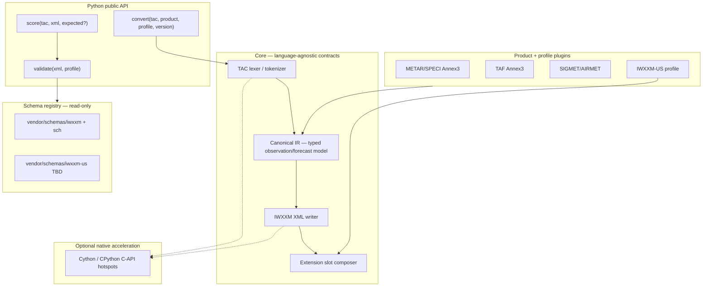

# Context — General TAC→IWXXM Converter Architecture

> **Mode**: scoped | **Slug**: general-tac-iwxxm-converter | **Generated**: 2026-07-12  
> **Feature / workflow**: Design partner brief for a gifts-like, extensible, optionally C/Cython-accelerated TAC→IWXXM library covering WMO IWXXM + NOAA IWXXM-US | **Status**: active  
> **Session**: [S008-general-tac-iwxxm-converter](../sessions/S008-general-tac-iwxxm-converter/session-brief.md)

## Executive Summary

Today’s monorepo converts METAR/SPECI via pure-Python [`packages/gifts`](../../packages/gifts) (Annex 3 only; **RMK stripped**) and validates with lxml XSD/Schematron against [`vendor/schemas/iwxxm`](../../vendor/schemas/iwxxm) ([wmo-im/iwxxm](https://github.com/wmo-im/iwxxm)). **IWXXM-US schemas are not vendored**; US national content (FMH-1 Addendum, peak wind, variable RVR, etc.) is out of scope of gifts. **Accepted (ADR-013):** new package `packages/tac2iwxxm` with IR + plugins; WMO core + IWXXM-US profile via `extension` blocks ([MDL](https://vlab.noaa.gov/web/mdl/data-modeling)); vendor-pin `iwxxm-us`; pure Python then optional Cython; **v1 = FAA five** (AIRMET, METAR, SIGMET, SPECI, TAF). Gifts stays intact for upstream merges (REQ-014).

## Resolution Log

| ID | Category | Decision |
|----|----------|----------|
| R1 | Decision | **New package** `packages/tac2iwxxm`; keep gifts as Annex-3 reference/fallback — [ADR-013](../adr/ADR-013-tac2iwxxm-package-architecture.md) |
| R2 | Decision | **Pure Python v0 → Cython lexer later** after batch benchmarks — ADR-013 |
| R3 | Decision | **v1 = full FAA five**: AIRMET, METAR, SIGMET, SPECI, TAF (intl + IWXXM-US where published) — ADR-013 |
| R4 | Decision | **Vendor pin** `vendor/schemas/iwxxm-us` via `vendor/manifest.json` — ADR-013 |
| R5 | Ambiguity | Confirmed: **CPython + optional C/Cython** (NumPy pattern), not a different runtime — ADR-013 |
| R6 | Constraint | Do not rewrite gifts in-place during migration (REQ-016); gifts upstream remains manual (REQ-014) |

## Scope & Constraints

### In scope (design + accepted v1 goal)

- **v1 products (R3)**: AIRMET, METAR, SIGMET, SPECI, TAF — Annex-3 body + IWXXM-US profile
- Package `packages/tac2iwxxm` (R1) with IR + product/profile plugins
- Vendor pin for IWXXM-US (R4); WMO schemas remain existing vendor pins
- Accuracy metrics (structural, Schematron, golden-pair, field-level)
- Pure Python first; optional Cython lexer after benchmarks (R2/R5)

### Out of scope (until evolve build)

- Shipping Cython wheels or replacing `/api/v1/convert` in this 00 stage
- Editing `vendor/schemas/iwxxm*` content locally (sync-only)

### Linked features

| Id | Relationship |
|----|----------------|
| F1 | Evolves — conversion beyond Annex-3 METAR body |
| F2 | Consumes — validation remains Schematron/XSD gate |
| F4 | Consumes — multi-version IWXXM lines |
| M3 | Constraint — gifts stays mergeable package |
| **New Fn (proposed)** | `tac2iwxxm` general converter + IWXXM-US; FAA five in v1 — name/id TBD in 01-requirements |

### Hard constraints from corpus

- Template: `static+api` — converter is a **library** under `packages/`, not a new deployable
- Vendor WMO snapshots are SoT for international XSD/SCH ([Corpus: tech-spec] / M2)
- GIFTs: no automated upstream PRs (REQ-014); migration forbids product rewrites (REQ-016)

## Architecture proposal (design partner)

### Layered model



### Recommended package layout (gifts-like, monorepo)

```
packages/tac2iwxxm/          # name TBD — R1
  pyproject.toml            # uv workspace member; optional [tool.cython]
  src/tac2iwxxm/
    api.py                  # stable public surface
    ir/                     # dataclasses / msgspec / pydantic models
    products/
      metar_speci/
      taf/
      sigmet/               # future
      airmet/               # future
    profiles/
      annex3/
      iwxxm_us/             # FMH-1 / AFMAN remark → extension map
    codecs/                 # encode IR → lxml/ET elements
    validate/               # thin wrapper over shared Schematron runner
    metrics/                # accuracy scorers
    _native/                # optional .pyx / C — not required for v0
  tests/
    golden/
    edge_cases/
    metrics/
```

Keep **`packages/gifts`** as the Annex-3 reference implementation and optional backend fallback until parity metrics pass. New package should **not** import FastAPI/Supabase (same SoC as gifts).

### IR (intermediate representation) — why it matters

Gifts maps TAC → `dict` → ElementTree ad hoc. A general tool needs a versioned IR so that:

1. Annex-3 body and US REMARKS share one observation object
2. Metrics compare IR fields, not brittle XML strings alone
3. New products add IR modules without rewriting the XML writer
4. Native code can accelerate lexer/tokenizer while Python owns policy

Sketch (METAR observation):

| IR section | Annex-3 | IWXXM-US (profile) |
|------------|---------|---------------------|
| wind, visibility, RVR, weather, clouds, temp/dew, QNH | core | — |
| peak wind, wind shift, variable RVR | — | `AerodromePeakWind`, `AerodromeWindShift`, `AerodromeVariableRVR` |
| RMK groups (AO2, SLP, T, P, RAB, …) | ignored today | `Addendum`, `ProcessedProperty`, `RecentWeather`, … |
| lightning / TS location | limited | `VisuallyObservablePhenomena` |

### IWXXM-US integration pattern

Per MDL: US schemas **supplement** IWXXM via extension points (not replace). Encoder strategy:

1. Emit international IWXXM document for body (profile=`annex3` or `iwxxm_us`)
2. When profile=`iwxxm_us`, parse REMARKS / US TAC differences into IR extension nodes
3. Serialize into the documented host elements:
   - `<iwxxm:MeteorologicalAerodromeObservation>` → `Addendum`, visual phenomena, hail, max/min, …
   - `<iwxxm:AerodromeSurfaceWind>` → peak wind, wind shift
   - `<iwxxm:AerodromeHorizontalVisibility>` → tower / variable / sector visibility
   - `<iwxxm:AerodromeRunwayVisualRange>` → variable RVR
   - `<iwxxm:CloudLayer>` → variable ceiling / sky
   - `<iwxxm:METAR|SPECI>` → inoperative sensors, observing metadata
4. Validate with **combined** catalog: WMO XSD/SCH + IWXXM-US XSD (US Schematron if published)

TAF US types (`MeteorologicalAerodromeForecastExtension`, icing/turbulence/LLWS, amendment limitations) follow the same profile plugin pattern.

### Product plugin contract

```python
class ProductPlugin(Protocol):
    product_id: str                    # "metar_speci" | "taf" | ...
    def detect(self, tac: str) -> bool: ...
    def decode(self, tac: str) -> IR: ...
    def encode(self, ir: IR, *, version: str, profile: str) -> bytes: ...
    def edge_case_fixtures(self) -> Iterable[Fixture]: ...
```

```python
class ProfilePlugin(Protocol):
    profile_id: str                    # "annex3" | "iwxxm_us"
    namespaces: Mapping[str, str]
    def enrich(self, ir: IR, tac: str) -> IR: ...
    def apply_extensions(self, root: Element, ir: IR) -> None: ...
    def schema_bundle(self, version: str) -> SchemaBundle: ...
```

### Performance (NumPy analogy)

| Layer | Language | Rationale |
|-------|----------|-----------|
| Public API, IR, plugins, XML policy | Python | Extensibility, debuggability |
| TAC scanner / remark tokenizer | Cython or C | Hot loop over large bulletin batches |
| Tree serialization | Keep lxml (already C) | Avoid reimplementing XML in Cython first |
| Schematron | Existing lxml isoschematron / backend orchestrator | Dominates latency today — optimize after measure |

**v0**: pure Python IR + plugins + lxml writer (prove correctness/metrics).  
**v1**: profile Cython on lexer only after a batch benchmark harness exists.

Do **not** Cythonize Schematron or product policy first — wrong bottleneck and high maintenance.

### Accuracy metrics harness

| Metric | Definition | Gate |
|--------|------------|------|
| **M-parse** | TAC decodes without fatal error | required |
| **M-xsd** | XML passes product XSD | required |
| **M-sch** | Schematron failed-assert count = 0 (filter `@role` ERROR/FATAL) | required |
| **M-sch-warn** | WARN/CAUTION count (advisory) | report |
| **M-golden** | Canonicalize(XML) == golden (WMO translation pairs / NWS US examples) | per fixture |
| **M-field** | IR field equality vs annotated expected IR (edge cases) | per fixture |
| **M-ext-coverage** | % of IWXXM-US types exercised by fixtures | backlog KPI |
| **M-parity** | Diff vs gifts Annex-3 output on shared corpus | regression |

Sources:

- WMO pairs: `vendor/schemas/iwxxm-translation/`, `vendor/schemas/iwxxm/*/IWXXM/examples/`
- US examples: NWS iwxxm-us METAR examples (fetch; not in vendor today) — [test_corpus_sources.py](../../apps/backend/src/config/test_corpus_sources.py)
- Edge corpus: FMH-1 REMARKS matrix derived from MDL sample instances (peak wind, SLP, PFR, AO2, …)

Schematron severity: map SVRL using `@role` (FATAL/ERROR/WARN/…) per [Schematron severity guidance](https://schematron.com/standards/standard_severity_levels_with_schematron_%40role.html) when present in rules.

### Edge-case strategy

1. **Corpus-driven**: every MDL sample instance XML fragment → at least one TAC→XML fixture
2. **Property-based**: random valid IR → encode → validate (catch writer bugs)
3. **Negative**: malformed REMARKS → structured diagnostics, not silent drop (contrast gifts RMK strip)
4. **Profile isolation**: Annex-3 mode must still strip/ignore US-only remarks without failing international validation

## Environment / Topology

| Concern | Notes |
|---------|-------|
| Library-only | No new Render service; backend imports package later |
| Schemas | Runtime read from `vendor/schemas/`; US pin TBD (R4) |
| CORS / browser | Unchanged until API exposes new products/profiles |

## Existing Infrastructure

| Asset | Path | Role |
|-------|------|------|
| GIFTs package | `packages/gifts/` | Annex-3 METAR/TAF/VAA/TCA/SWA; no US; no SIGMET/AIRMET |
| Backend adapter | `apps/backend/.../gifts_adapter.py` | METAR/SPECI only |
| Validation | `apps/backend/.../validation_orchestrator.py` | lxml XSD + Schematron |
| Vendor IWXXM | `vendor/schemas/iwxxm` @ v2025-2 | XSD + `rule/iwxxm.sch` |
| Translation goldens | `vendor/schemas/iwxxm-translation/` | TAC↔XML (2023-1) |
| US corpus config | `apps/backend/src/config/test_corpus_sources.py` | Remote NWS examples |
| Migration goldens | `test-data/golden/` | METAR regression |

## Cross-Reference Matrix

| Topic | gifts today | WMO vendor | IWXXM-US (MDL) | Proposed |
|-------|-------------|------------|----------------|----------|
| METAR body | Yes | XSD+SCH | Host for extensions | Core plugin |
| METAR RMK / US | Stripped | N/A | Addendum + 20+ types | US profile |
| TAF | Package yes / API no | XSD+SCH | ForecastExtension | Plugin + profile |
| AIRMET/SIGMET | Missing | XSD+SCH patterns | US differences (FAA) | v1 plugins (R3) |
| Schematron SoT | Java CRUX optional; API uses lxml | `iwxxm.sch` | Need US schemas | Shared registry |
| Speed | Pure Python ET | — | — | Python + optional Cython lexer |

## Implementation Backlog (post-00)

1. ~~Resolve R1–R5~~ — done; [ADR-013](../adr/ADR-013-tac2iwxxm-package-architecture.md)
2. **01-requirements**: Fn id/name, UJs for FAA five, phased acceptance within v1 goal, license, non-goals
3. **04-tech-plan**: IWXXM-US upstream URL/tag for manifest, IR schema, metrics CI, optional Cython extra
4. Scaffold `packages/tac2iwxxm` after evolve plan — METAR/SPECI Annex-3 parity vs gifts first
5. IWXXM-US METAR/SPECI REMARKS → Addendum/extension codecs + MDL fixture pack
6. TAF Annex-3 + US forecast extensions
7. SIGMET + AIRMET plugins (greenfield; intl + US differences)
8. API/profile wiring + connectivity gates if UI exposes products
9. Benchmark harness → Cython lexer only if justified

## Data & Credentials

| Asset | Source | Commit? |
|-------|--------|---------|
| WMO schemas | `vendor/manifest.json` pins | yes (already) |
| IWXXM-US XSDs/examples | nws.weather.gov / MDL | pin under `vendor/schemas/iwxxm-us` (R4); tag TBD in 04 |
| FMH-1 / AFMAN text | external manuals | cite only; do not commit PDFs unless licensed |

## Unresolved Gaps

- Exact public URL/version pin for IWXXM-US XSD bundle (examples known; full schema tree URL in 04) — R4 decided *that* we vendor, not *which* tag yet
- AIRMET/SIGMET US filed differences docs thinner than METAR/TAF — gather in 01/04; may gate acceptance order inside v1
- Dual-run gifts vs `tac2iwxxm` during API cutover — decide in 04/16-evolve
- License for `tac2iwxxm` (gifts is Public Domain) — decide in 01

## Architecture sketch — METAR US path

```
TAC: METAR KJFK ... RMK AO2 PK WND 33031/2105 SLP027 ...
        │
        ├─► Annex3Decoder → IR.core
        └─► UsRemarksDecoder → IR.us (observingSystemType=AO2, peakWind, seaLevelPressure, …)
                │
                ▼
        IwxxmWriter(version=2025-2)
                ├─► iwxxm:METAR / observation body
                └─► extension → iwxxm-us:Addendum + AerodromePeakWind on surface wind
                │
                ▼
        Validate(WMO sch + IWXXM-US xsd) → MetricsReport
```

## Sources

- [Repo: packages/gifts] — facade Encoder, metarDecoder RMK strip, validation CRUX
- [Repo: vendor/manifest.json] — wmo-im pins v2025-2
- [Repo: apps/backend gifts_adapter + validation_orchestrator]
- [Docs: feature-list.md] F1/F2/F4, REQ-014/016
- [External: wmo-im/iwxxm](https://github.com/wmo-im/iwxxm)
- [External: MDL Data Modeling / IWXXM-US](https://vlab.noaa.gov/web/mdl/data-modeling)
- User-provided IWXXM-US METAR/SPECI + TAF modeling reports (v3.0, Dec 2022)
- Explore agents: gifts architecture, vendor/IWXXM-US absence
