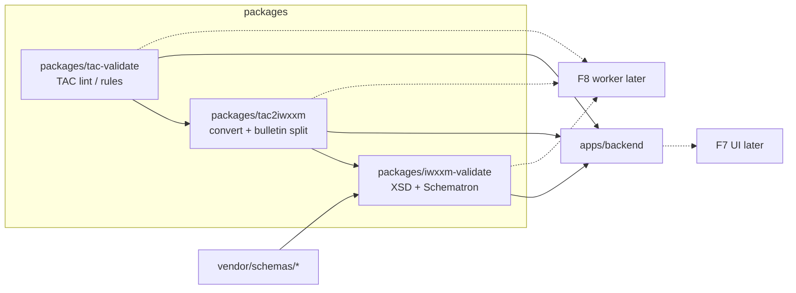

# Context — Realtime TAC Ingest, Validation Packages & Data Entry

> **Mode**: scoped | **Slug**: realtime-tac-ingest | **Generated**: 2026-07-12  
> **Feature / workflow**: Near-realtime TAC→IWXXM pipeline design + package-first validation/lint APIs; F7/F8 named Planned | **Status**: active  
> **Session**: [S008-general-tac-iwxxm-converter](../sessions/S008-general-tac-iwxxm-converter/session-brief.md)  
> **Amends**: [general-tac-iwxxm-converter.md](general-tac-iwxxm-converter.md) (F6 library) — does **not** replace ADR-014 cutover decisions

## Executive Summary

S008 already defined **F6** (`packages/tac2iwxxm`) for multi-product TAC→IWXXM (seven products, Annex-3 + IWXXM-US). This amend adds product intent for **general TAC data entry (F7)** and a **near-realtime ingest → convert → Schematron gate (F8)**, but **this cycle builds package APIs only**: conversion (F6), **IWXXM Schematron/XSD** in a new shared package, and **TAC lint/rules** in a second new package. Schematron remains on **IWXXM only**; TAC gets separate syntax/business checks. Operational ingest sources, auth, and push sinks are **researched / deferred**. Bulletin splitting is a **v1 package acceptance** requirement. Latency target for the future F8 path is **seconds (&lt;5–15s E2E)** with **horizontal worker scale** (no drop).

## Resolution Log

| ID | Category | Decision |
|----|----------|----------|
| R1 | Decision | Amend S008 (reopen 00+01); do not open S009 |
| R2 | Decision | “Realtime” = **ingest pipeline** (continuous feed → near-RT convert + Schematron), not typeahead UX |
| R3 | Decision | Schematron on **IWXXM only** (extend F2); TAC uses separate checks |
| R4 | Decision | Operator **UI + machine ingest** share one pipeline conceptually (F7 + F8) |
| R5 | Decision | Ingest **sources**: research-first (ICAO Translation Centre / bulletin / AMHS–SWIM patterns); no v1 adapter pick yet |
| R6 | Decision | Latency target **&lt;5–15s** E2E when F8 ships |
| R7 | Decision | Future **Render Background Worker** for F8 (template drift → ADR when built) |
| R8 | Decision | Ingest product scope = **F6 seven**: AIRMET, METAR, SIGMET, SPECI, TAF, VAA, TCA |
| R9 | Decision | **F7** = multi-product TAC work sessions / operator entry; **F5 stays METAR/SPECI-only** |
| R10 | Decision | Future F8: **store + push**; on fail → **quarantine** (no publish) |
| R11 | Decision | Feature ids: **F7** data entry, **F8** near-RT ingest pipeline |
| R12 | Decision | **Postpone auth** and **push sinks** — package-first this cycle |
| R13 | Decision | TAC pre-checks = **parse gate + shared TAC rule pack** |
| R14 | Decision | Bulletin unit: research default → **must split WMO AHL bulletins** in v1 package |
| R15 | Decision | Backpressure: **scale worker replicas**; drop nothing (when F8 ships) |
| R16 | Decision | **This cycle**: package APIs only; F7/F8 **Planned** in standing docs, no worker/UI/auth/sinks build |
| R17 | Decision | Schematron/XSD → **`packages/iwxxm-validate`** (name confirm in 01) |
| R18 | Decision | TAC (+ all product TAC forms) lint/rules → **separate package** (e.g. `packages/tac-validate`) |
| R19 | Research | ICAO OPMET: Translation Centre converts TAC→IWXXM on **bulletin** basis; international IWXXM via **AMHS/FTBP** (not AFTN); SWIM (AMQP/OGC) emerging. App role ≈ translator + validate-before-disseminate, not full AFS node. |

## Scope & Constraints

### In scope (this amend — package + product naming)

| Work | Maps to |
|------|---------|
| Deepen F6 convert package; **required bulletin splitter** | F6 |
| New `packages/iwxxm-validate` — XSD + Schematron (WMO; + US when profile) | F2 evolve / shared lib |
| New `packages/tac-validate` — TAC lint + business rules for all seven products | New package (feeds F6/F7/F8) |
| Name **F7**, **F8** in feature-list as Planned (design stubs) | Product |
| Document template drift: future worker for F8 | ADR stub / non-goal amend |

### Out of scope (this cycle’s build)

- Render worker deployable, queue wiring, AMHS/SWIM adapters
- F7 multi-product UI / session persistence beyond F5
- Auth for machine ingest; push sinks (webhook/S3/AMHS)
- Changing F5 METAR-only rule

### Linked features

| Id | Relationship |
|----|----------------|
| F2 | Evolves — Schematron moves behind `iwxxm-validate` package API |
| F5 | Unchanged — METAR/SPECI sessions only |
| F6 | Deepens — bulletin IR/split; consumes both validate packages |
| **F7** | Planned — multi-product operator entry / sessions (later) |
| **F8** | Planned — near-RT ingest worker + store/push + quarantine (later) |
| M1 | New packages under `packages/` |

### Hard constraints

- Template remains **`static+api`** until F8 build adds worker (ADR required)
- Vendor schemas read-only; Schematron from `vendor/schemas/*`
- ADR-014: Rust/PyO3 optional; gifts removed at convert wire-up — unchanged
- F6 non-goal “no new Render deployable” applies to **converter microservice**; F8 **worker** is an explicit future exception (document in 01)

## Proposed package topology

### Suggested public APIs (design — names TBD in 01/04)

| Package | Responsibility |
|---------|----------------|
| `tac-validate` | Lint TAC text / bulletin fragments; product-aware rules; structured issues (not Schematron) |
| `tac2iwxxm` | Split bulletin → reports; convert TAC → IWXXM XML; profiles/versions |
| `iwxxm-validate` | XSD + Schematron against vendor pins; profile-aware (WMO / IWXXM-US) |

Pipeline (shared by future F7/F8 and current API):

1. Ingest unit (single or bulletin) → **split** (R14/R21)
2. **tac-validate** → fail → quarantine path (when F8) / error response (API)
3. **tac2iwxxm.convert** → IWXXM
4. **iwxxm-validate** (Schematron/XSD) → fail → quarantine / error; pass → store (+ later push)

## Environment / Topology (future F8)

| Concern | Decision / deferral |
|---------|---------------------|
| Latency | &lt;5–15s E2E target |
| Scale | Worker replicas; no drop |
| Sources | Research; likely HTTP/file drop first for app; AMHS/SWIM adapters later |
| Sinks | Store + push — **postponed** |
| Auth | **Postponed** |
| Browser | F7 different-origin CORS same as today when UI ships |

## Existing Infrastructure

| Asset | Path | Notes |
|-------|------|-------|
| F6 standing spec | `docs/feature-list.md` F6 | Seven products; ADR-013/014 |
| Converter brief | `docs/context/general-tac-iwxxm-converter.md` | Partially superseded by ADR-014 (Rust) |
| Validation today | `apps/backend` + F2 | lxml XSD/Schematron; extract to package |
| Vendor WMO | `vendor/schemas/iwxxm*` | SoT for Schematron |
| IWXXM-US | pin planned | F6 / ADR-013 |
| F5 sessions | Supabase | METAR/SPECI only — do not reuse for F7 v1 without new feature work |

## Cross-Reference Matrix

| Topic | Prior corpus | This amend |
|-------|--------------|------------|
| Convert engine | F6 / ADR-014 | + bulletin split required |
| Schematron | F2 in backend | → `packages/iwxxm-validate` |
| TAC quality | Implicit in gifts/parse | → `packages/tac-validate` |
| Multi-product UI sessions | F5 METAR-only non-goal | **F7** Planned; F5 unchanged |
| Continuous ingest | Absent | **F8** Planned; build deferred |
| Worker deployable | F6 non-goal: no new Render service | F8 exception later + ADR |

## Implementation Backlog (package-first)

1. **01-requirements delta** — add F7/F8 Planned stubs; extend F2/F6; dependency + component rows for two new packages; amend F6 non-goals for future worker exception.
2. **ADR** — package split (`iwxxm-validate` + `tac-validate`) and deferral of F7/F8 build.
3. **04-tech-plan** — bulletin IR, rule-pack layout, Schematron runner API, CI metrics wiring.
4. **Later session** — F8 worker, adapters, auth, sinks, F7 UI.

## Data & Credentials

- No new secrets for package-only work.
- Future F8: sink URLs, ingest credentials — out of scope until auth/sinks un-postponed.

## Unresolved Gaps

| Gap | Downstream |
|-----|------------|
| Exact package names (`tac-validate` vs `tac-lint`) | 01 AskQuestion / ADR |
| Bulletin dialect coverage (which AHL/TT patterns in v1) | 04 + fixtures |
| Concrete ingest adapter after research | F8 evolve |
| Whether F2 API remains thin wrapper only | 01 API contract delta |

## Sources

- Interview Q1–Q22 (S008 amend 2026-07-12) — decisions R1–R18
- [ICAO Guidelines — OPMET exchange using IWXXM](https://www.icao.int/sites/default/files/METP/Documents/Guidlines-for-the-Implementation-of-OPMET-Data-Exchange-using-IWXXM_5th-Edition.pdf) — Translation Centre, bulletin basis, AMHS/FTBP
- [ICAO APAC IWXXM FAQs (2025)](https://www.icao.int/sites/default/files/APAC/Documents/edocs/MET/2025-03_IWXXM-FAQs_3rd-Ed.pdf)
- [WMO AHLs for aviation over AFS](https://community.wmo.int/site/knowledge-hub/programmes-and-initiatives/wmo-information-system-wis/about-manual-gts/ahls-aviation-data-over-icao-afs)
- [wmo-im/iwxxm](https://github.com/wmo-im/iwxxm) — Schematron/XSD SoT
- [NOAA MDL Data Modeling / IWXXM-US](https://vlab.noaa.gov/web/mdl/data-modeling)
- [Corpus: product] `docs/feature-list.md`, [ADR-014](../adr/ADR-014-tac2iwxxm-rust-gifts-removal.md)
