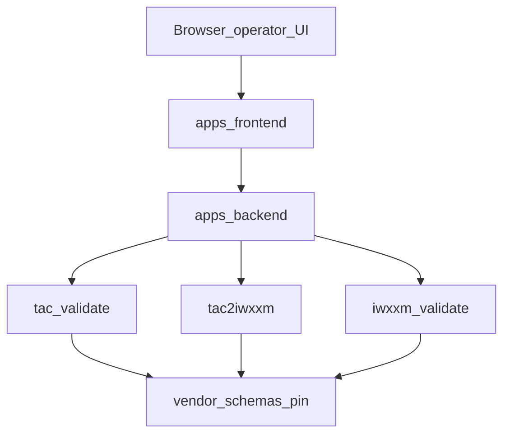

# Image / figure pointers

**Git policy:** do **not** commit ICAO/WMO PDFs, workshop slide PNGs, or production
screenshots into this repo. Insert them only into your personal `.pptx`. Local digs may
already exist under gitignored `.local/reference/`.

---

## Per-slide figure plan

| Slide | Visual | Where to get it | Notes |
|-------|--------|-----------------|-------|
| 1 | Org / product logo only | Your brand assets | Optional |
| 2 | TAC ↔ IWXXM dual diagram | **Draw** in PPT (two boxes + arrow) | Do not scrape third-party art |
| 3 | Landings list screenshot *or* icon row | Browser: schemas.wmo.int, codes.wmo.int, ICAO store listing page | Fair-use screenshot of public landing; cite URL in notes |
| 4 | Architecture boxes | Redraw from mermaid below / [Corpus: system-spec] | Prefer original redraw |
| 5 | Pipeline chevrons | Draw 7 stages from domain README | Text labels match hub table |
| 6 | `vendor/manifest.json` excerpt | Open file in editor → screenshot keys/tags only | Public file |
| 7 | Workbench UI | **Local** Vite preview (`apps/frontend`) — non-deployed | Ask before using staging/prod |
| 8 | Dig → catalog → lint flow | Draw 3 boxes | Cite PROVENANCE_MAP |
| 9 | (table is visual) | — | — |
| 10 | PPT-02 slides 6–7 (landings) | Official: [ICAO filebrowser](https://www.icao.int/filebrowser/download/26741?fid=26741); local: `.local/reference/ppt-02-iwxxm-framework-wmo/extracts/slide-images/` | **Informative**; attribute TT-AvData / ESAF; do not commit PNGs |
| 11 | Optional stack icons | Simple text list preferred | Avoid random icon packs with unclear license |
| 12 | None | — | — |

---

## Architecture mermaid (slide 4 — redraw in PPT)

ASCII source of truth: [docs/spec.md](../../spec.md) §Runtime (S038 / EV-031 target).

---

## PPT-02 local extract index (optional personal use)

If you previously ran the mining extract:

| Path (gitignored) | Contents |
|-------------------|----------|
| `.local/reference/ppt-02-iwxxm-framework-wmo/` | PDF + fulltext |
| `…/extracts/slide-images/` | Rendered PNGs for slides 5, 9, 11, 12, 14, 16, 17, etc. |
| `…/extracts/resources-landings.txt` | Slides 6–7, 10 URL list |

Standing dig: [PPT-02-IWXXM-Framework-WMO-mining-notes.md](../../domain/mining/PPT-02-IWXXM-Framework-WMO-mining-notes.md).

**Attribution line for speaker notes when using PPT-02 figures:**  
“Source: WMO TT-AvData, IWXXM Framework, ESAF Virtual Regional Workshop, 22 Oct 2025
(ICAO filebrowser). Informative — not encode/validate SoT. Runtime pin: IWXXM v2025-2.”

---

## UI screenshots (slide 7)

1. Start local frontend (non-deployed) — see [docs/ops/DEVELOPMENT.md](../../ops/DEVELOPMENT.md).  
2. Capture: (a) workbench with product picker + editor; (b) decode panel or lint console with source attribution.  
3. Store under `.local/pptx-screenshots/` (create; keep gitignored) or insert straight into PPT.  
4. Label slide: “Local non-deployed preview” if showing UI.

---

## Package × line matrix (optional add-on slide)

Prefer a **redrawn** 2-column table (2023-1 / 2025-2) from
[VERSION_SUPPORT_POLICY.md](../../domain/iwxxm/VERSION_SUPPORT_POLICY.md) Appendix A
(informative capture). Do not present PPT-02 p.5 as machine SoT — defer to vendored XSD
`version=` attributes.
